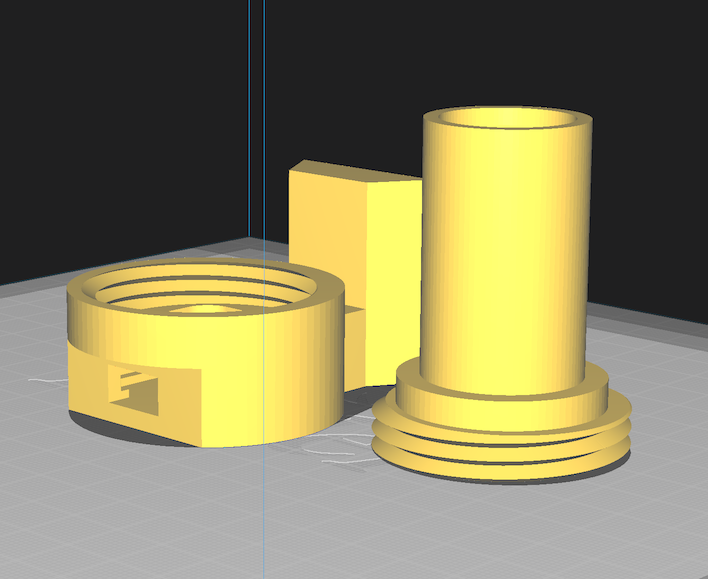
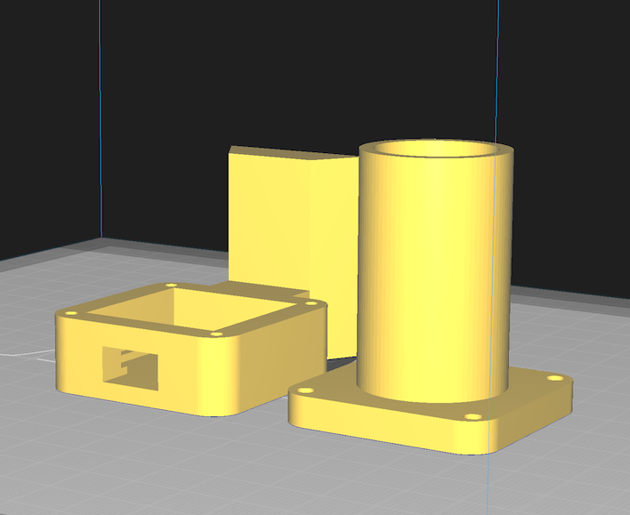

# 3D-Printable Parts

All parts are designed in [OpenSCAD](https://openscad.org/) for FDM printing. The hood, cap, and lens accessories print without supports; the base needs localised slicer supports (see [Print Settings](#print-settings)). Source files are in [`hardware/3d_models/`](https://github.com/meridianfield/pushnav/tree/main/hardware/3d_models).

---

## Threaded Camera Housing (recommended)

Complete enclosure for the camera module with M12 lens. Three parts that screw and friction-fit together. No external fasteners needed.

### PCB Base + Threaded Lip + Dovetail

Cylindrical 50 mm shell holding the camera PCB. Internal 44 mm female thread accepts the hood. Integrated dovetail rail slides into a standard telescope finder shoe. USB cable exits through a chord-flat on the rear of the base.

[:material-download: Download Base](https://github.com/meridianfield/pushnav/raw/main/hardware/3d_models/stls/housing_v2_base.stl){ .md-button .md-button--primary }

### Hood + Male Thread + Baffle

Matching male thread at the bottom screws hand-tight into the base. Stepped flange and tall baffled lens shroud above. The stepped light baffle is a staircase approximation of the camera's field-of-view cone that blocks stray light while preserving the full FOV.

[:material-download: Download Hood](https://github.com/meridianfield/pushnav/raw/main/hardware/3d_models/stls/housing_v2_hood.stl){ .md-button .md-button--primary }

### Dust Cap

Friction-fit cap that protects the lens when not in use. Slips over the hood's narrow end.

[:material-download: Download Cap](https://github.com/meridianfield/pushnav/raw/main/hardware/3d_models/stls/housing_v2_cap.stl){ .md-button .md-button--primary }

!!! tip "Thread fit on your printer"
    The threads are toleranced for typical FDM printers (0.4 mm clearance between male and female). If the hood binds or feels too loose on your printer, edit `lip_thread_tolerance` at the top of [`housing_v2.scad`](https://github.com/meridianfield/pushnav/blob/main/hardware/3d_models/housing_v2.scad) (increase for a looser fit, decrease for tighter), then re-render the base and hood STLs.

---

## Bolted Camera Housing (legacy)

Original bolted design, retained for existing builds. Requires four M3 screws to attach the hood to the base.

### PCB Base + Dovetail Rail

Holds the camera PCB with screw standoffs. Integrated dovetail rail slides into a standard telescope finder shoe. USB cable exits through a rear slot.

Two screw hole variants are available:

| Variant | Hole Size | Use |
|---------|-----------|-----|
| Self-tapping | 2.7mm | Self-tapping screws bite directly into plastic |
| Bolt-through | 3.5mm | M3 bolts pass through, secured with nuts |

[:material-download: Download Base (self-tap)](https://github.com/meridianfield/pushnav/raw/main/hardware/3d_models/stls/housing_base_selftap.stl){ .md-button }
[:material-download: Download Base (bolt-through)](https://github.com/meridianfield/pushnav/raw/main/hardware/3d_models/stls/housing_base_bolt.stl){ .md-button }

### Hood + Baffle

Cylindrical lens shroud with an integral stepped light baffle. Screws onto the base via the mounting plate.

[:material-download: Download Hood](https://github.com/meridianfield/pushnav/raw/main/hardware/3d_models/stls/housing_hood.stl){ .md-button }

### Dust Cap

Friction-fit cap. Slips over the hood cylinder.

[:material-download: Download Cap](https://github.com/meridianfield/pushnav/raw/main/hardware/3d_models/stls/housing_cap.stl){ .md-button }

---

## Lens Accessories

### M12 Lock Ring

Lock ring that secures the M12 lens at the correct focus position. Features a tapered centering collar and grip notches for finger tightening.

[:material-download: Download Lock Ring](https://github.com/meridianfield/pushnav/raw/main/hardware/3d_models/stls/lock_ring.stl){ .md-button .md-button--primary }

---

## Print Settings

| Setting | Housing | Lock Ring |
|---------|---------|-----------|
| Material | PLA or PETG | PLA or PETG |
| Layer height | 0.2mm | 0.12mm |
| Infill | 20% | 100% |
| Supports | Base only (see below) | None |

!!! note "Base supports"
    The hood and cap are support-free, but the **base** needs slicer supports in two places:

    - **USB cutout roof** (threaded *and* bolted): the top edge of the USB slot is an unsupported span.
    - **Upper edge of the chord-flat** (threaded only): above the flat, the back of the cylinder returns to its full diameter and overhangs the chord below.

    Enable supports in your slicer (Cura, PrusaSlicer, OrcaSlicer, Bambu Studio) with "Supports on build plate only" or tree supports. Both regions are detected automatically.

!!! note
    The lock ring should be printed at 100% infill and 0.12mm layer height for thread strength and a smooth finish. Use opaque filament for the housing to prevent stray light leaking through the walls.

---

## All Downloads

| File | Description |
|------|-------------|
| [`housing_v2_base.stl`](https://github.com/meridianfield/pushnav/raw/main/hardware/3d_models/stls/housing_v2_base.stl) | Threaded PCB Base + Dovetail |
| [`housing_v2_hood.stl`](https://github.com/meridianfield/pushnav/raw/main/hardware/3d_models/stls/housing_v2_hood.stl) | Threaded Hood + Baffle |
| [`housing_v2_cap.stl`](https://github.com/meridianfield/pushnav/raw/main/hardware/3d_models/stls/housing_v2_cap.stl) | Threaded Dust Cap |
| [`housing_base_selftap.stl`](https://github.com/meridianfield/pushnav/raw/main/hardware/3d_models/stls/housing_base_selftap.stl) | Bolted PCB Base (2.7mm self-tap holes) |
| [`housing_base_bolt.stl`](https://github.com/meridianfield/pushnav/raw/main/hardware/3d_models/stls/housing_base_bolt.stl) | Bolted PCB Base (3.5mm bolt-through holes) |
| [`housing_hood.stl`](https://github.com/meridianfield/pushnav/raw/main/hardware/3d_models/stls/housing_hood.stl) | Bolted Hood + Baffle |
| [`housing_cap.stl`](https://github.com/meridianfield/pushnav/raw/main/hardware/3d_models/stls/housing_cap.stl) | Bolted Dust Cap |
| [`lock_ring.stl`](https://github.com/meridianfield/pushnav/raw/main/hardware/3d_models/stls/lock_ring.stl) | M12 Lock Ring |
