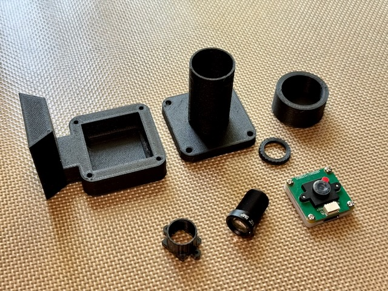
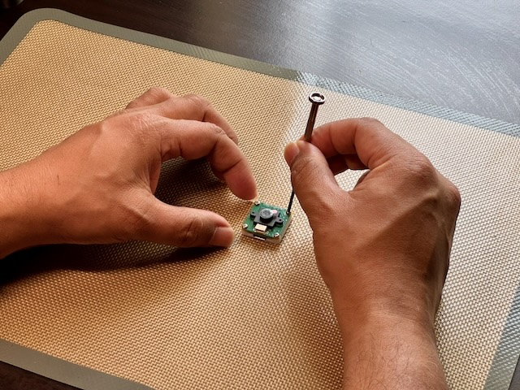
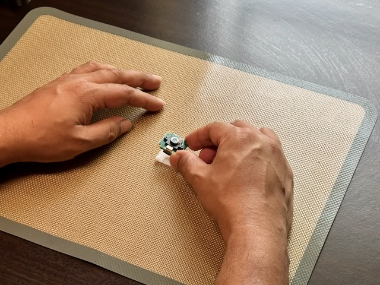
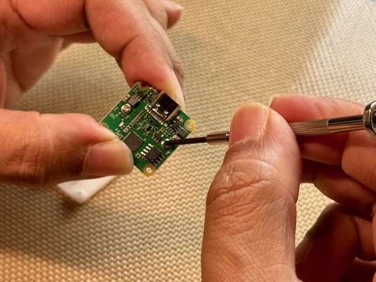
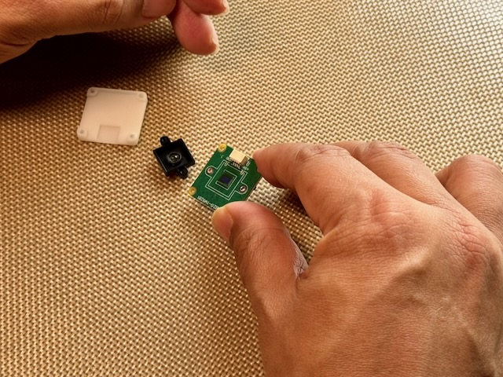
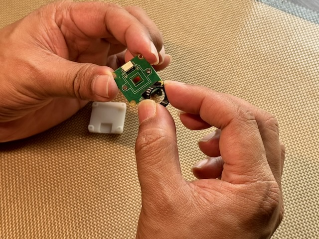
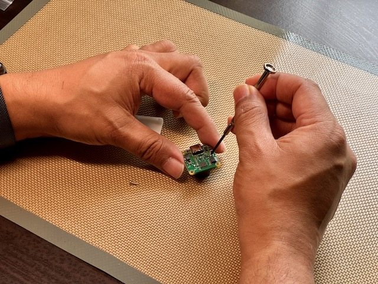
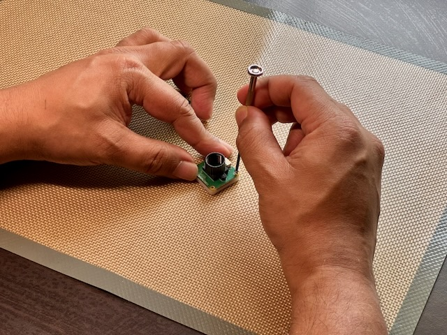
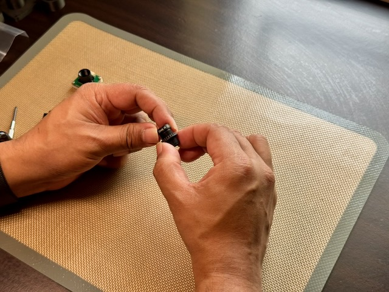
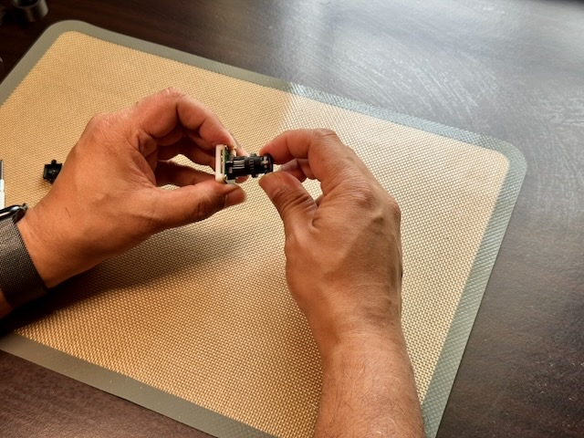

# DIY Notes

## Shopping List

- [Waveshare OV9281 1MP Mono USB Camera](https://www.waveshare.com/ov9281-1mp-usb-camera-a.htm)
- [M12 Mount 25mm F2.4 Lens](https://www.seeedstudio.com/5MP-25mm-lens-p-5579.html)
- [M12 lens holder/mount](https://www.fabtolab.com/arducam-lh001-lh002-lh003-6mm-8.5mm-12mm-height-m12-p0-5-plastic-lens-mount-for-raspberry-pi) (18mm screw pitch *only*)

## Modifications Required

The camera ships with a wide-angle lens that needs to be replaced with the 25mm lens for proper plate-solving performance. But the stock lens is not a standard M12 mount, so you will need to 3D print an adapter or buy a ready-made M12 mount to hold the lens in place. Buying a ready-made M12 mount is recommended because it involves tiny M2 screws that can be difficult to create holes for in a 3D printed part. Also, this component must be completely opaque to prevent stray light from diffusing to the sensor. If 3D printing, make sure to use opaque filament and consider adding a layer of black tape for extra light sealing.

> Removing the existing lens and lens mount exposes the camera sensor. Protect the sensor from dust and fingerprints while working on the camera. Since we will be using the camera in low light conditions, any dust or smudges will appear as large blobs in the image and can interfere with plate-solving. Handle the camera carefully and consider working in a clean environment to minimize dust exposure.

- Remove the white plastic base of the camera by unscrewing the four screws on the corners. This will expose the screws that hold the lens mount in place.
- Remove the stock lens and lens mount from the camera PCB. Removing the lens holder removes the exiting lens as well. 
- Install the M12 lens mount onto the camera PCB using the existing mounting holes. This will provide a standard M12 thread for attaching the new lens.
- Add the 3D printed focus lock nut to the lens. You will need to tighten this lock nut against the lens holder once you have achieved proper focus to prevent the lens from moving due to vibrations while pushing the telescope.
- Attach the 25mm F2.4 M12 lens to the new mount.
- Reassemble the white plastic base of the camera.

## DIY Assembly

- Finish the camera modifications as described above to get the camera ready for use with PushNav. This involves replacing the stock lens with the 25mm M12 lens and ensuring it is securely mounted and focused.
- 3D print the camera housing parts (base, hood, dust cap). Refer to the  3D models section of the documentation
- Secure the camera inside the housing base. Choice of adhesive depends on whether you want to remove the camera later:
    - **Hot glue gun.** Use if you may want to remove the camera to refit or reuse later. It's reversible (peels off with gentle prying), but the thick bead can introduce small alignment errors, so press the camera flat while the glue sets.
    - **Super glue (or other thin adhesives).** Use once you're satisfied with alignment and focus and don't plan to remove the camera. Thin adhesives give a much more precise, rigid bond with no alignment drift.

    In both cases, glue the **white camera base** to the housing (never the PCB) to avoid damaging components. *TODO: design a more secure, glue-free mounting solution in the future.*
- **IMPORTANT** focusing notes: 
    - Focus the camera by adjusting the position of the lens in its mount before attaching the hood. 
    - Focus is best done with the camera looking at real stars in the night sky.
    - Use the PushNav app or any camera viewer software to see the live feed from the camera while adjusting focus.
    - Try to achive the best focus possible, as this will improve plate-solving performance. 
    - Once you have achieved good focus, tighten the M12 lock nut against the lens holder to secure the lens in place. This is an important step to prevent the lens from shifting due to vibrations while pushing the telescope, which would throw off focus and plate-solving. Remember that while locking the lens in place, the focus might shift slightly. Be aware of this and try to focus again by loosening the lock nut, adjusting focus, and re-tightening until you find the optimal focus position that is also securely locked.
    - *Note* : If you are focusing on a bright star, the star might not be pin point and could be a bit bloated even at optimal focus due to the brightness of the star. In this case, try focusing on a slightly dimmer star to get a better sense of the focus quality. 
- Attach the hood to the base.
- Ready to use with PushNav!

## Detailed Assembly Instructions

<figure markdown="span">
  
  <figcaption>Remove the 4 screws on the corners of the camera to separate the white plastic base from the PCB.</figcaption>
</figure>

---

<figure markdown="span">
  
  <figcaption>Remove the PCB from the white plastic base.</figcaption>
</figure>

---

<figure markdown="span">
  
  <figcaption>On the back of the PCB, locate the screws that hold the lens mount in place. Unscrew them to remove the lens mount.</figcaption>
</figure>

---

<figure markdown="span">
  
  <figcaption>Remove the lens mount from the PCB. Take care not to touch the sensor and do not allow dust to settle on it. This will reduce the sensitivity of the sensor and introduce smudges and dust bunnies in the images.</figcaption>
</figure>

---

<figure markdown="span">
  
  <figcaption>Place the M12 lens mount onto the PCB, ensuring it is properly aligned with the screw holes in the PCB.</figcaption>
</figure>

---

<figure markdown="span">
  
  <figcaption>Reverse the PCB and screw the M12 lens mount onto the PCB, ensuring it is securely fastened.</figcaption>
</figure>

---

<figure markdown="span">
  
  <figcaption>Reassemble the camera by placing the PCB back into the white plastic base.</figcaption>
</figure>

---

<figure markdown="span">
  
  <figcaption>Screw the locking nut onto the M12 lens before screwing the lens into the mount.</figcaption>
</figure>

---

<figure markdown="span">
  
  <figcaption> After focus is done, lock the lens in place by tightening the M12 lock nut. You may need to adjust the focus slightly by loosening the lock nut, fine-tuning the focus, and re-tightening until you achieve optimal focus.</figcaption>
</figure>
