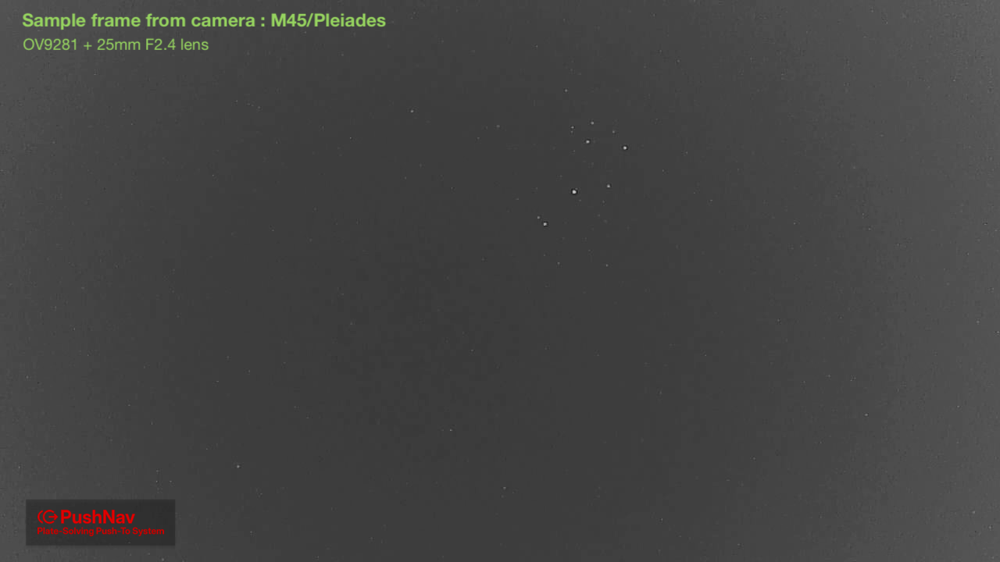

## Supported Hardware

Currently support is provided only for this combination of camera and lens:

- **Camera**: [Waveshare OV9281 1MP Mono USB Camera](https://www.waveshare.com/ov9281-1mp-usb-camera-a.htm) [$26]
- **Lens**: [M12 Mount 25mm F2.4 Lens](https://www.seeedstudio.com/5MP-25mm-lens-p-5579.html) [$15]

## Why This Camera and Lens

- Off the shelf, affordable, and widely available
- For use in urban light polluted skies:
    - Mono sensor provides substantially better sensitivity and contrast for star detection compared to a color sensor
    - F2.4 aperture provides good light gathering power required to detect faint stars in light polluted urban skies
    - 25mm focal length in combination with the OV9281's 1/4" sensor size provides a ~8° field of view which is a good balance between having enough stars for reliable plate-solving and speed of solving
    - In my bortle 8 city sky with a visual limiting magnitude of around 2.5, this camera/lens combo can reliably detect and plate-solve on stars down to about magnitude 6.5
- Standard USB (UVC) interface allows for cross-platform compatibility without needing custom drivers
- Calculated image scale and field of view (Astrometry results):
    - Size:	8.86° x 4.98° 
    - Radius: 5.081°
    - Pixel scale: 24.9 arcsec/pixel

>Currently only this specific camera and lens combination is supported. Support for additional cameras and lenses may be added in the future based on demand and usability. I decided to keep it this way for now to ensure a consistent and reliable user experience. Also this combination is very affordable and widely available, so it should be accessible for most users.

## Sample Frame

- Bortle 8.5 city sky (Chennai, India)
- Visual limiting magnitude of around 2.3 mag approx
- M45 (Pleiades) invisible through naked eye. Haze, light pollution Dome
- M45 clearly visible in frame from camera
- Camera + F2.4 lens captures stars up to ~6.3 mag in city sky with haze and light pollution. This is sufficient for plate-solving with good confidence.
- More that 40 stars detected to plate-solve with confidence
- A 4 magnitudes improvement in limiting magnitude increases the number of stars visible by a factor of 40 approximately.

## Adding Support for More Cameras

- Adding the camera's VID/PID to the camera server's supported device list and implementing any necessary quirks for frame capture (if required)
- Generating the tetra3 star database for the new camera/lens's field of view and plate scale.
