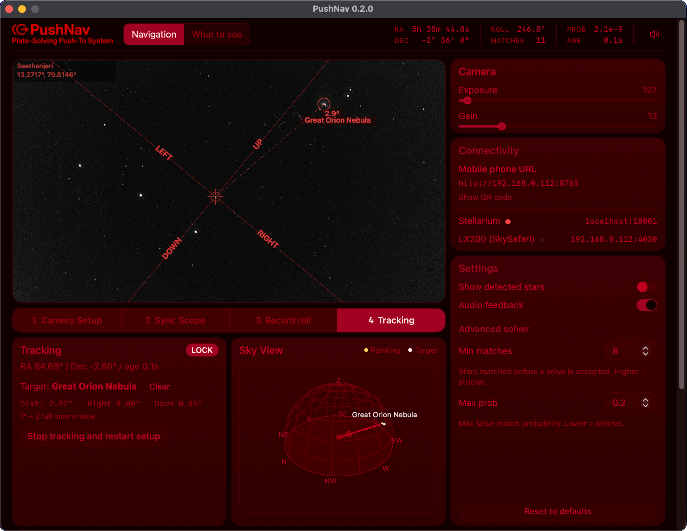
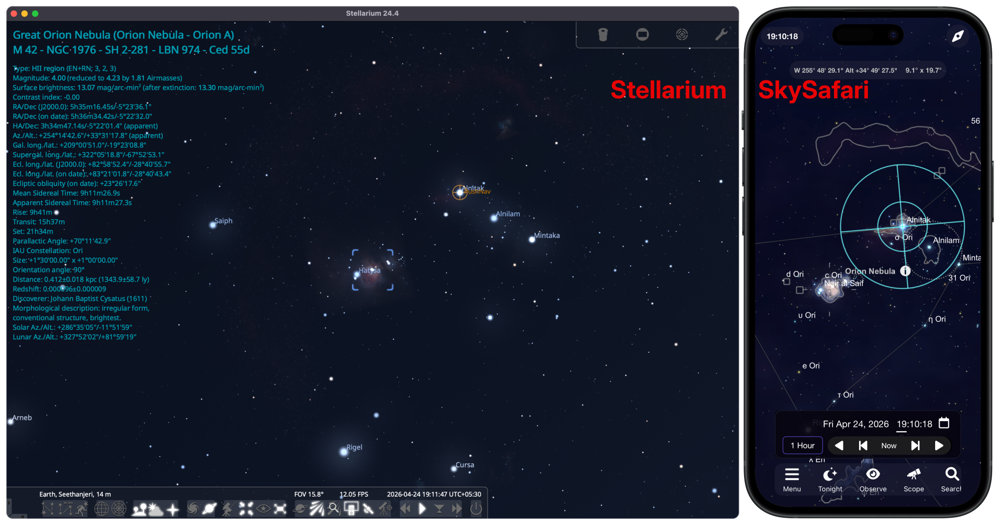

# PushNav
Plate-Solving Push-To System for Manual Telescopes

A cross-platform plate-solving push-to system for manual telescopes. PushNav uses a live camera feed to continuously plate-solve and determine where your telescope is pointing, reporting coordinates to Stellarium, SkySafari, and other planetarium apps in real-time. No encoders, no motors, no GOTO mount required. Just a USB camera, a lens, and your laptop. Under **$50** in total hardware.

Don't have a planetarium app, or don't want to switch between two screens? PushNav can run completely standalone. Pick targets from its built-in **What to See** catalog (a curated short-list of 161 hand-picked objects, a search across more than 20,000 stars and deep-sky objects, or a manual RA/Dec panel), follow the push direction, and watch your scope's pointing on the on-screen **Sky View** dome. No other software required.

!!! info "What is plate-solving?"
    Any part of the night sky has a unique arrangement of stars. Plate-solving is a technique that takes a photo, matches that arrangement against a catalog, and reports exactly where the camera is pointing, down to a fraction of a degree. PushNav runs it continuously on the live camera feed, so the app always knows where your telescope is aimed.

PushNav uses the European Space Agency's (ESA) [tetra3](https://github.com/esa/tetra3) fast lost-in-space plate solver, the same algorithm family that powers spacecraft navigation. This efficient solver produces near real-time solutions on a live video feed, enabling seamless push-to navigation even in light-polluted urban skies.

Above: PushNav in tracking mode. The right-hand **Sky View** dome shows the current pointing (yellow) and the active GOTO target (cream) on a hemispheric grid above the local horizon.

## Push-to ops

Pick a target either inside PushNav or from any planetarium app you already use. PushNav's built-in **"What to See"** catalog covers a curated short-list, a fuzzy search across more than 20,000 stars and deep-sky objects, and a manual RA/Dec panel. Or stay in **Stellarium** on the desktop (or **SkySafari**, **Stellarium Mobile**, **INDI**, or **ASCOM** on a phone or tablet) and send the target from there. Either way, PushNav guides you to push the telescope to it, and your scope's live pointing moves on every connected app's sky chart in real time, staying in sync across all clients.

Above: **M42 (Orion Nebula)** is the active target on both **Stellarium** (desktop) and **SkySafari** (phone). As the scope is pushed, each plate-solve updates the telescope crosshair on every connected client simultaneously. No mount control, no GoTo motors. Just a camera and Wi-Fi.

## Cross platform from the ground up

Supports **Windows**, **macOS**, and **Linux**. The core app is written in Python, while the camera server is a native binary for each platform (Swift on macOS, C/V4L2 on Linux, C/DirectShow on Windows) to achieve maximum performance and compatibility with UVC cameras.

## How It Works

1. Observer picks a target from PushNav's built-in **What to See** catalog, or from a planetarium app (Stellarium on the desktop, or SkySafari / Stellarium Mobile PLUS / INDI / ASCOM on a phone or tablet), and sends it to PushNav.
2. PushNav shows how to push the telescope to reach the target in its UI. A built-in mobile web interface lets you view the same guidance on your phone: scan a QR code and you're connected.
3. Your telescope's pointing shows in real time on the on-screen **Sky View** dome. When a planetarium app is connected, it also appears as a live crosshair on the app's sky chart, staying in sync across all clients.

### Internal workflow

1. A USB camera in place of your telescope's finder captures the star field
2. PushNav plate-solves frames using the [tetra3](https://github.com/esa/tetra3) star pattern recognition library in near real-time
3. The difference in pointing is calculated and translated into directional guidance which is shown in the UI
4. Solved RA/Dec coordinates are exposed to connected planetarium apps over standard telescope-control protocols, so your telescope's pointing moves on the app's sky chart in real-time as you push.

## Features

- Near real-time plate solving (~20–140 ms per frame)
- One time, simple calibration. No named stars, just point at any bright star and sync
- GOTO navigation guidance for targets picked inside PushNav's **What to See** catalog or sent from your planetarium app (Stellarium, SkySafari, Stellarium Mobile, etc.)
- Works with **SkySafari**, **Stellarium Mobile**, **INDI**, and **ASCOM** clients over Wi-Fi via the LX200 protocol. See [SkySafari & Other Apps](skysafari-setup.md)
- Built-in **"What to See"** target picker — pick a target without leaving PushNav. Three modes: a curated **Buddy** catalog (161 hand-picked deep-sky objects with filters), an **Advanced** fuzzy search across 12,522 NGC objects and 8,825 bright stars, and **Manual coordinates** for anything else. See [Using PushNav](using-pushnav.md#picking-targets-inside-pushnav).
- Audio feedback for lock/lost/GOTO events
- Mobile web interface: scan a QR code on the PushNav screen with your phone for at-the-eyepiece push direction, no app install needed
- Always-visible **Sky View** — an interactive 3D hemispheric dome showing current pointing, the active target, and a small telescope marker on the pointing axis; visible during every step of the workflow.
- Saves calibration for quick re-sync
- Works from urban light-polluted skies with the right camera/lens combo (see hardware guide)

## Open source: please report issues

PushNav is free and open source under the GPLv3. It's been tested in real observing sessions with **Stellarium** (desktop) and **SkySafari Plus/Pro**. The Stellarium Mobile, INDI, and ASCOM paths follow the same LX200 protocol and should work out of the box, but haven't yet been field-tested against every client version.

If something doesn't work as described (or you'd like to see an app supported that isn't listed), please open an issue on the [GitHub issue tracker](https://github.com/meridianfield/pushnav/issues). Reports from real observing sessions are the best way for the project to improve.
