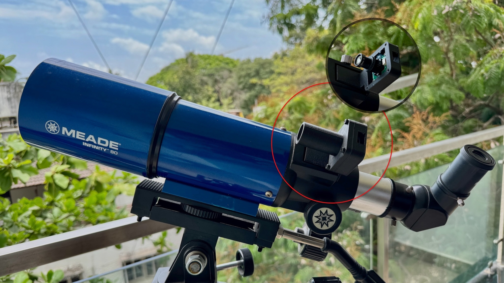
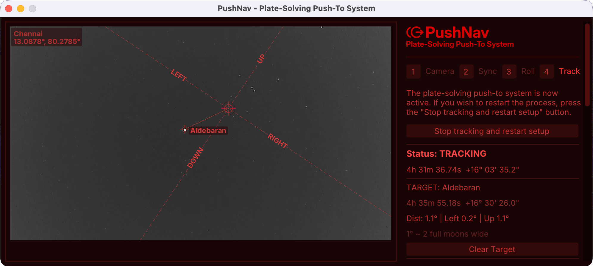

# PushNav
Plate-soving Push-To System for Manual Telescopes

A cross-platform plate-solving push-to system for manual telescopes. PushNav uses a live camera feed to continuously plate-solve and determine where your telescope is pointing, reporting coordinates to Stellarium in real-time. Point your scope at any bright star, sync, and PushNav will track your pointing as you push to your next target — no encoders, no motors, no GOTO mount required.

It uses European Space Agency's (ESA) tetra3 fast lost-in-space plate solver for plate-solving. This effecient algorithm produces near real-time solutions on a live video feed.

Power your non-GOTO manual telescope with PushNav and enjoy seamless push-to navigation, even in light-polluted urban skies. All for under **$50** with an off-the-shelf USB UVC camera and lens. The same technology that powers spacecraft navigation and advanced astrophotography apps is now available for your backyard stargazing sessions.

## Cross platform from ground up

Supports **Windows**, **macOS**, and **Linux**. The core app is written in Python, while the camera server is a native binary for each platform (Swift on macOS, C/V4L2 on Linux, C/DirectShow on Windows) to achieve maximum performance and compatibility with UVC cameras.

## How It Works

1. Observer selects an object in Stellarium and "Slews" (Cmd+1 or Ctrl+1)
2. PushNav shows how to push the telescope to reach the target in its UI. 
3. Alternatively the telescope's pointing is also shown in Stellarium as a telescope crosshair that moves in real-time as you push the scope.

#### Internal workflow

1. A USB camera in place of your telescope's finder captures the star field
2. PushNav plate-solves frames using the [tetra3](https://github.com/esa/tetra3) star pattern recognition library in near real-time
3. The difference in pointing is calculated and translated into directional guidance which is shown in the UI
4. Solved RA/Dec coordinates are also broadcast to Stellarium via its telescope protocol, so you can see your telescope's pointing in Stellarium's sky chart in real-time as you push.

## Features

- Near real-time plate solving (~20–140 ms per frame)
- One time, simple calibration. No named stars, just point at any bright star and sync
- GOTO navigation guidance from Stellarium
- Audio feedback for lock/lost/GOTO events
- Saves calibration for quick re-sync
- Works from urban light-polluted skies with the right camera/lens combo (see hardware guide)
