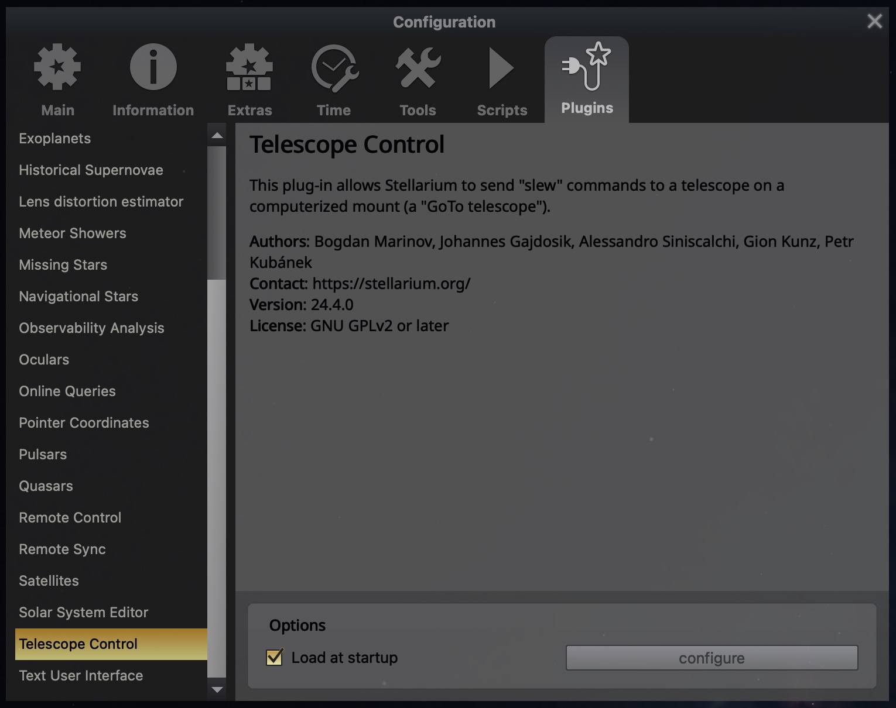
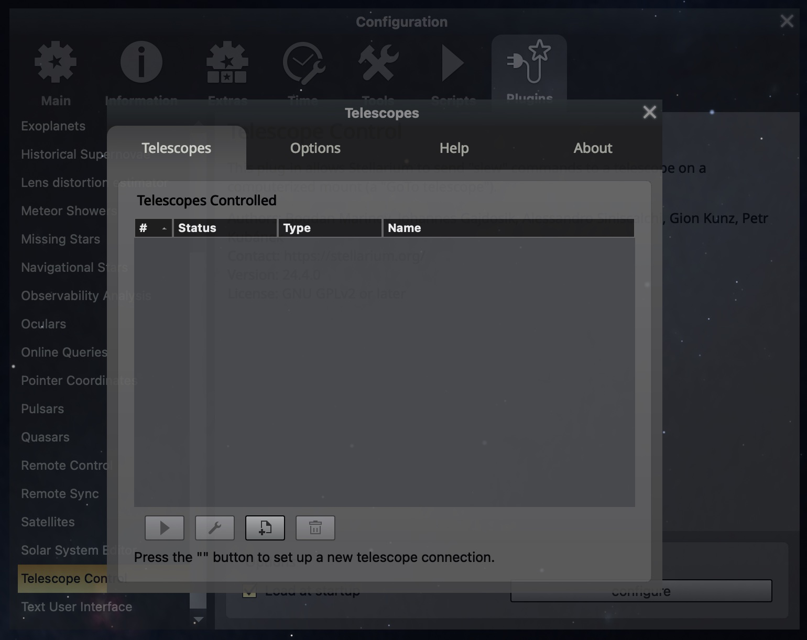
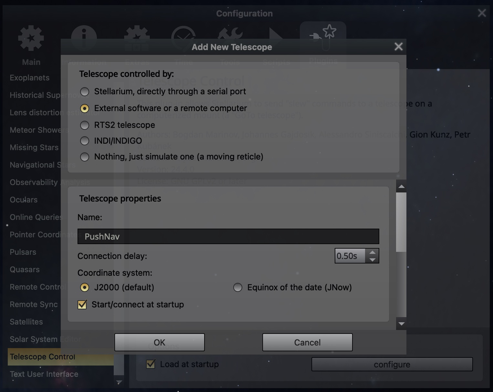
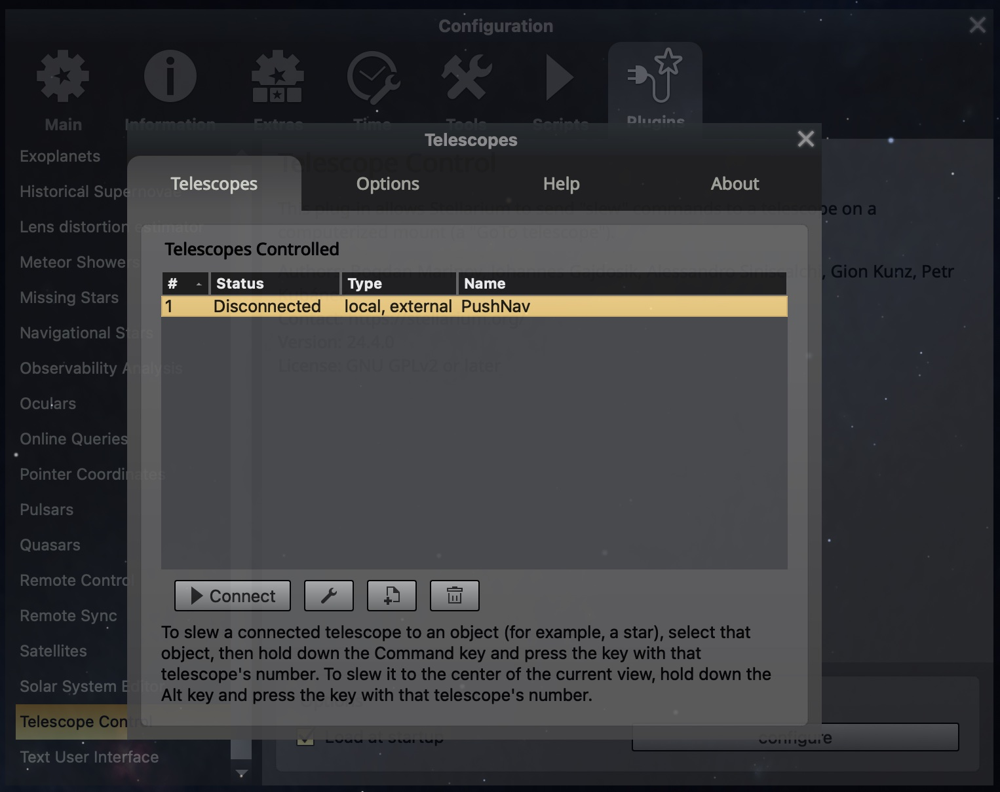
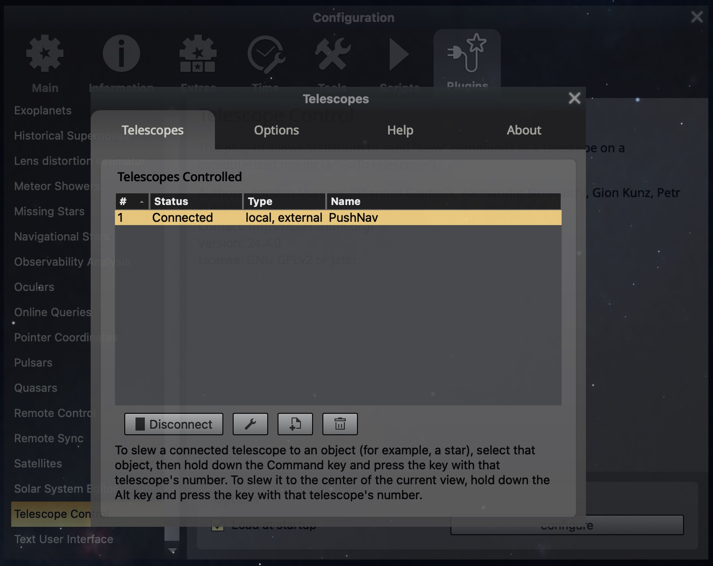
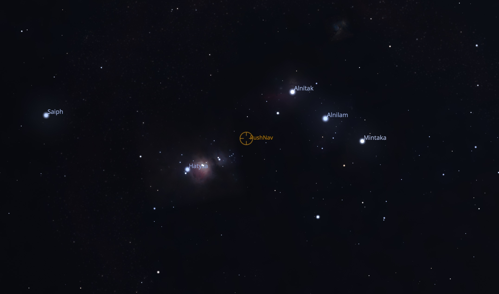
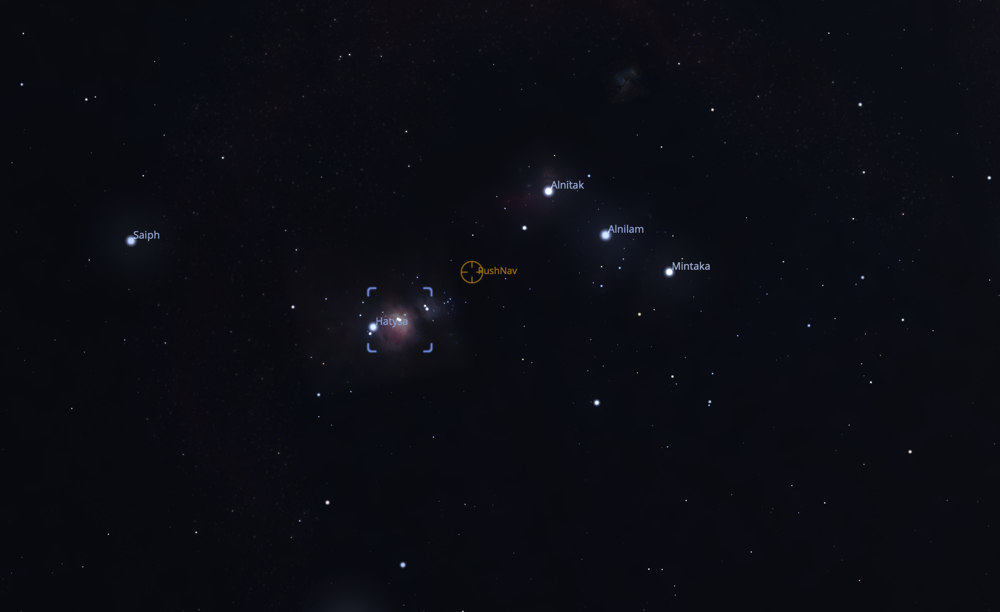
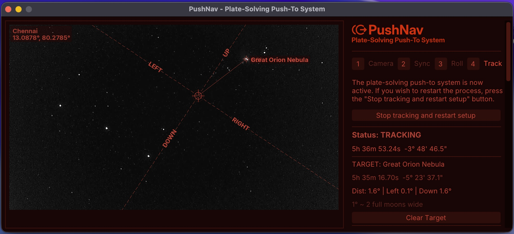

# Connecting Stellarium to PushNav

PushNav doesn't have its own sky chart — it uses [Stellarium](https://stellarium.org/) instead. Stellarium is a free, open-source planetarium app with a beautiful sky chart, thousands of deep-sky objects, and it runs on all platforms. PushNav plugs into Stellarium as a virtual telescope, so you get the best of both: Stellarium for finding and picking targets, PushNav for guiding you there.

This is a one-time setup. Once it's done, Stellarium and PushNav reconnect automatically every time you start them.

## What you'll end up with

- A **live crosshair** on Stellarium's sky chart showing exactly where your telescope is pointing, updating in real time as you push
- **One-click target selection** — click any object in Stellarium and press a keyboard shortcut to send it to PushNav
- **Push direction** in PushNav's side panel — "left 2°, down 1°" — until the target is centered in your eyepiece

## What you'll need

- [Stellarium](https://stellarium.org/) installed on the same computer as PushNav
- PushNav installed and running

## Step 1 — Enable the Telescope Control plugin

Open Stellarium and press **F2** to open Configuration. Click the **Plugins** tab, then scroll the left list and select **Telescope Control**.

Tick **Load at startup**, then **restart Stellarium**. The plugin only activates on startup.

After restarting, go back to **Configuration → Plugins → Telescope Control** and click **configure**.

## Step 2 — Create a new telescope

You'll see an empty **Telescopes Controlled** list.

Click the **+** button at the bottom to add a new telescope.

## Step 3 — Configure it for PushNav

Fill in the dialog like this:

| Setting | What to pick |
|---|---|
| Telescope controlled by | **External software or a remote computer** |
| Name | `PushNav` (or whatever you like) |
| Coordinate system | **J2000 (default)** — don't change this |
| Start/connect at startup | ✓ tick this |

Scroll down and set:

| Setting | What to enter |
|---|---|
| Host | `localhost` |
| TCP Port | `10001` |

!!! warning "Leave the coordinate system on J2000"
    PushNav only speaks J2000 coordinates. If you switch this to JNow, the crosshair in Stellarium will be slightly off from where your telescope is actually pointing. If things seem "close but not quite right," this is almost always the reason.

Click **OK**.

## Step 4 — Connect

PushNav now appears in the list as **Disconnected**.

Make sure PushNav is **running**, then click **Connect**.

## Step 5 — Verify

The status should change to **Connected** within a second.

That's it for setup. Close the dialog. Because you ticked "Start/connect at startup," this will happen automatically from now on — you won't need to open this dialog again.

## Step 6 — See the crosshair

Look at Stellarium's sky chart. You'll see a small crosshair labelled **PushNav** — this is where your telescope is pointed right now, updating live.

Push your telescope gently and watch the crosshair move in sync. No encoders, no motors — just the camera seeing the stars and figuring out where it's looking.

## Step 7 — Pick a target

Click any object in Stellarium — a star, a nebula, a galaxy, anything. Stellarium highlights it with selection brackets.

Now press **Cmd+1** (Mac) or **Ctrl+1** (Windows / Linux). This sends the target to PushNav.

## Step 8 — Push to it

Switch to PushNav. The side panel shows the target name and how far you need to push:

In this example, PushNav is saying: push the telescope **left by 0.1°** and **down by 1.6°** to reach the Great Orion Nebula. The main view shows arrows pointing in the push direction.

As you push, the numbers shrink in real time. When they get close to zero, the target should be visible in your eyepiece — center it by eye and enjoy the view.

To pick a different target, just click another object in Stellarium and press **Cmd+1** again. To stop tracking, click **Clear Target** in PushNav.

## Troubleshooting

**Can't connect — status stays "Disconnected".**

- Make sure PushNav is running *before* you click Connect in Stellarium. PushNav is the server; Stellarium connects to it.

**The crosshair is in the wrong part of the sky.**

- Check that the coordinate system in the telescope settings is set to **J2000**, not JNow. This is the most common cause.
- Make sure Stellarium's location and time are set correctly for where you are.
- Make sure PushNav has actually solved at least once — if the step indicator in PushNav still says *Sync* rather than *Track*, it doesn't know where it's pointed yet.

**Cmd+1 / Ctrl+1 doesn't seem to do anything.**

- You need to click an object in Stellarium first so it's selected (you'll see brackets around it).
- Make sure the telescope is connected (check the Telescopes dialog).
- On Mac, make sure Stellarium's window has focus before pressing the shortcut.

**PushNav shows the target coordinates but not the name.**

- PushNav gets object names from Stellarium's **Remote Control** plugin. If that plugin isn't enabled, coordinates still work but the name will be blank. To fix: go back to **Configuration → Plugins**, find **Remote Control**, tick **Load at startup**, and restart Stellarium.

## What's next

With Stellarium and PushNav connected, the typical observing workflow is: center any bright star in your eyepiece, press **Next** in PushNav to sync, then start picking targets in Stellarium. See the [DIY Notes](diy-notes.md) page for tips on mounting the camera to your telescope.
