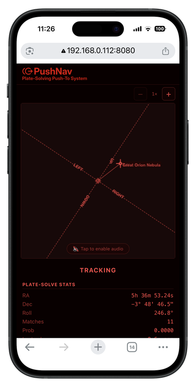

# Using PushNav

Once Stellarium is connected, you're ready to observe. PushNav walks you through a quick setup each session — and after your first time, it can be as fast as a single button press.

## The four steps

PushNav's side panel shows a numbered progress bar: **1 Camera → 2 Sync → 3 Roll → 4 Track**. You move through them by pressing the **Next** button.

### First session (full calibration)

The first time you use PushNav, you'll go through all four steps:

**Step 1 — Camera.** PushNav shows the live camera feed. Make sure you can see stars — they should look like small bright dots, not blurry blobs. Adjust the **Exposure** slider if the image is too dark or too bright. When the stars look sharp, press **Next**.

**Step 2 — Sync.** This is where PushNav learns where your telescope is pointing. Here's what to do:

1. Pick **any bright star** you can see in the sky — it doesn't matter which one. You don't need to know its name. Sirius, Vega, Betelgeuse, or just "that bright one over there" — any will do.
2. Center that star in your **eyepiece** as accurately as you can. Use a higher-magnification eyepiece for better accuracy. The more centered it is, the more accurate your push-to guidance will be for the rest of the session.
3. Press **Next**. PushNav will plate-solve the camera frame and figure out which star you're looking at.
4. PushNav highlights the star it thinks you synced on. If it picked the right one, press **Confirm Sync**. If it picked the wrong star (rare, but possible in dense star fields), tap the correct star on the preview, then confirm.

!!! tip "Center in the eyepiece, not the camera"
    A common first-time mistake: centering the star in the *camera preview* on your laptop screen. That's the wrong reference — the camera is offset from the main optics. What matters is that the star is centered in your **eyepiece view** (what you see looking through the telescope). PushNav figures out the offset between the camera and your eyepiece during sync.

**Step 3 — Roll calibration.** PushNav needs to know how the camera is rotated relative to your telescope's axes. It will ask you to **push the telescope up** (increase altitude) for a moment. As you push, PushNav watches the stars move across the camera frame and calculates the rotation angle. This happens automatically — you'll see a progress indicator, and it completes in a few seconds.

**Step 4 — Track.** You're live. PushNav is continuously plate-solving the camera feed and reporting your telescope's position to Stellarium. The crosshair on Stellarium's sky chart moves in real time as you push.

### Subsequent sessions (skip calibration)

PushNav saves your sync and roll calibration between sessions. From the second session onwards, you only need to do **Step 1** — confirm that stars are visible in the camera feed — and then press **Use Previous Calibration** to jump straight to tracking. The whole process takes a few seconds.

This is safe as long as you haven't physically moved the camera on the telescope since the last session. If you've remounted the camera or adjusted the finder shoe, do a fresh sync and roll calibration instead.

Now pick a target in Stellarium (click it, then **Cmd+1** / **Ctrl+1**), and PushNav will show you the push direction.

## Reading the push direction

When a target is active, the main view shows directional arrows — **LEFT / RIGHT / UP / DOWN** — with the target name at the tip of the arrow. The side panel shows the separation in degrees, for example `1.3° L  1.0° U` meaning "push left 1.3° and up 1.0°."

As you push the telescope, the numbers shrink live. When they get close to zero, look through your eyepiece — your target should be there.

## Using the mobile companion

You don't need to keep looking at your laptop while pushing. Open PushNav's **Settings** panel, scan the **QR code** with your phone, and you'll get a live mobile view showing the same push direction and target info — right in your hand at the eyepiece.

## Why the arrows might feel rotated

The first time you use PushNav, you might notice that "LEFT" on the screen doesn't exactly match what feels like "left" on your telescope. This is normal and expected.

The camera sits in a finder shoe on the side of your telescope tube. Because of this mounting position, the camera's view is slightly rotated compared to your telescope's altitude and azimuth axes. The rotation depends on where the finder shoe is on the tube, the angle of the shoe, and even the curve of the tube itself.

This is exactly what **Step 3 (Roll calibration)** corrects. After calibration, PushNav's arrows accurately reflect the directions you need to push — even if the camera is mounted at an odd angle. Just follow the arrows and trust the numbers; they account for the rotation.

If the directions ever feel wrong (e.g. after bumping the camera), just restart PushNav's setup (press **Stop tracking and restart setup**) and redo the sync and roll calibration. It takes less than a minute.

## Tips for a good session

- **Use a higher-magnification eyepiece for sync.** The more precisely you center the sync star, the more accurate the push-to guidance will be.
- **Don't touch the camera after sync.** If the camera shifts on the telescope (loose finder shoe, bumped cable), the calibration is off. PushNav will still track, but the push directions will be wrong. Redo sync if this happens.
- **Pick targets that are above the horizon.** Stellarium shows objects below the horizon too — if you send one of those to PushNav, the arrows will try to push you through the ground.
- **Bright targets first.** For your first session, pick easy bright targets — the Orion Nebula, the Pleiades, a bright double star. Once you're confident the system is working, go after fainter objects.
