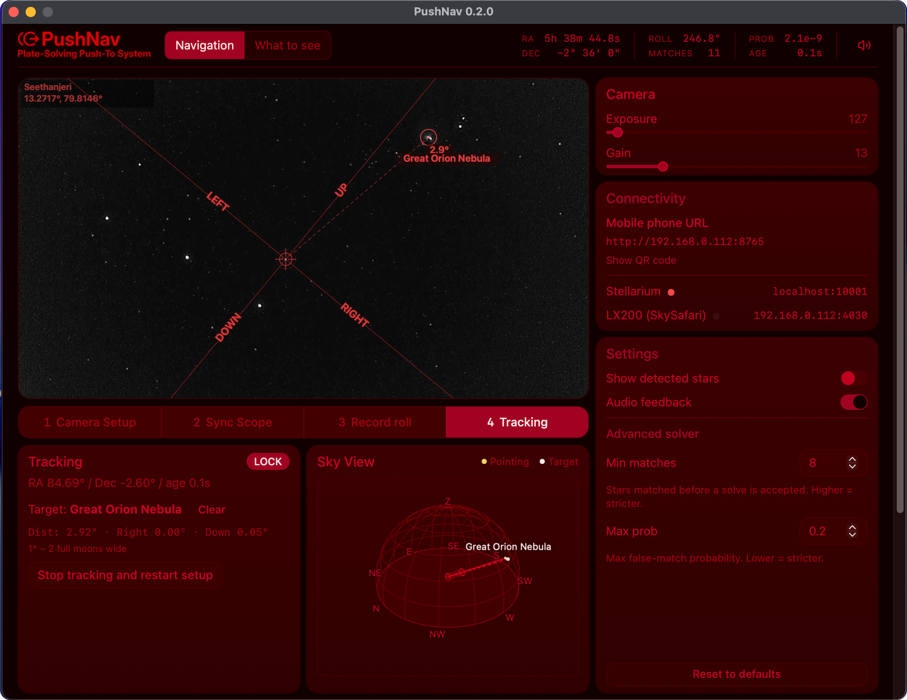
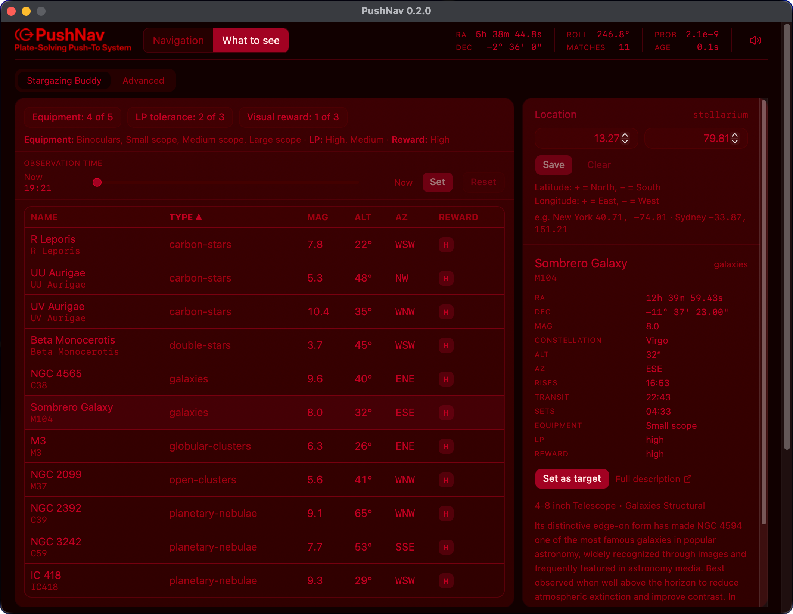
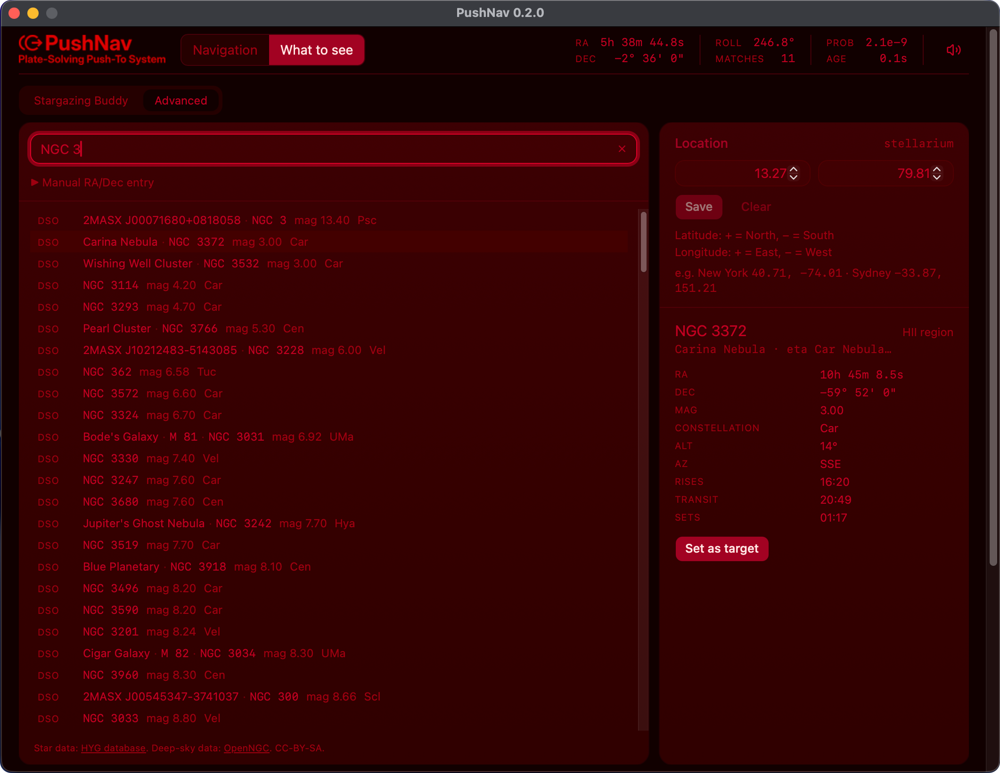
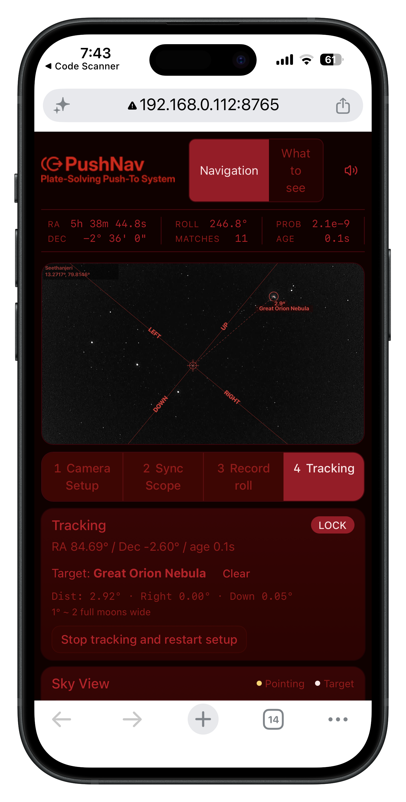

# Using PushNav

Once your camera is connected, you're ready to observe. PushNav walks you through a quick setup each session, and after your first time, it can be as fast as a single button press.

## The four steps

PushNav's side panel shows a numbered progress bar: **1 Camera → 2 Sync → 3 Roll → 4 Track**. You move through them by pressing the **Next** button.

### First session (full calibration)

The first time you use PushNav, you'll go through all four steps:

**Step 1. Camera.** PushNav shows the live camera feed. Make sure you can see stars; they should look like small bright dots, not blurry blobs. Adjust the **Exposure** slider if the image is too dark or too bright. When the stars look sharp, press **Next**.

**Step 2. Sync.** This is where PushNav learns where your telescope is pointing. Here's what to do:

1. Pick **any bright star** you can see in the sky. It doesn't matter which one. You don't need to know its name. Sirius, Vega, Betelgeuse, or just "that bright one over there" will do.
2. Center that star in your **eyepiece** as accurately as you can. Use a higher-magnification eyepiece for better accuracy. The more centered it is, the more accurate your push-to guidance will be for the rest of the session.
3. Press **Next**. PushNav will plate-solve the camera frame and figure out which star you're looking at.
4. PushNav highlights the star it thinks you synced on. If it picked the right one, press **Confirm Sync**. If it picked the wrong star (rare, but possible in dense star fields), tap the correct star on the preview, then confirm.

!!! tip "Center in the eyepiece, not the camera"
    A common first-time mistake: centering the star in the *camera preview* on your laptop screen. That's the wrong reference. The camera is offset from the main optics. What matters is that the star is centered in your **eyepiece view** (what you see looking through the telescope). PushNav figures out the offset between the camera and your eyepiece during sync.

**Step 3. Roll.** PushNav needs to know how the camera is rotated relative to your telescope's axes. It will ask you to **push the telescope up** (increase altitude) for a moment. By watching which direction the stars actually move when you push, PushNav learns the angle between the camera's reference frame and your telescope's axes. That's what keeps the push arrows accurate even if the camera is mounted at an angle. This happens automatically; you'll see a progress indicator, and it completes in a few seconds.

**Step 4. Track.** You're live. PushNav is continuously plate-solving the camera feed. Your telescope's position updates in real time on the on-screen **Sky View** dome, and is broadcast to any connected planetarium app (Stellarium, SkySafari, Stellarium Mobile, INDI, ASCOM) so their charts stay in sync.

### Subsequent sessions (skip calibration)

PushNav saves your sync and roll calibration between sessions. From the second session onward, you only need to do **Step 1** (confirm that stars are visible in the camera feed), then press **Use Previous Calibration** to jump straight to tracking. The whole process takes a few seconds.

This is safe as long as you haven't physically moved the camera on the telescope since the last session. If you've remounted the camera or adjusted the finder shoe, do a fresh sync and roll calibration instead.

Above: PushNav in tracking mode.

Now pick a target, either from PushNav's built-in **What to See** tab or from whichever planetarium app you have connected, and PushNav will show you the push direction.

## Picking targets inside PushNav

For target picking, PushNav doesn't make you choose between simplicity and reach. The built-in **What to See** tab gives you both side by side.

- **Buddy** — 161 hand-picked deep-sky objects with filters for equipment, light pollution and visual reward. The "what should I look at tonight?" answer for a new observer who doesn't know the sky yet.
- **Advanced** — fuzzy search across **12,522 NGC objects** (OpenNGC) and **8,825 bright stars** (HYG). The "give me M81" answer when you already know what you want.
- **Manual coordinates** — RA/Dec entry for the rest: comets, asteroids, satellites, anything ephemeris-driven that no catalog covers.

For every match, the right side of the tab shows a detail card with the object's current altitude / azimuth, rise / transit / set times, and a **Set as target** button. Click it and PushNav jumps back to the Navigation tab with the chosen target loaded. The button is disabled when an object is below the horizon (no point pushing through the ground).

!!! tip "Set your location first"
    Visibility math needs to know where you're observing from. Open the **Location** panel in the right column and enter your latitude and longitude (or let Stellarium provide it automatically when connected). Without a location, the catalog still works as a directory, but the alt/az and rise/set columns stay blank and the below-horizon guard can't run.

## Reading the push direction

When a target is active, the main view shows directional arrows (**LEFT / RIGHT / UP / DOWN**) with the target name at the tip of the arrow. The side panel shows the separation in degrees, for example `1.3° L  1.0° U` meaning "push left 1.3° and up 1.0°."

As you push the telescope, the numbers shrink live. When they get close to zero, look through your eyepiece. Your target should be there.

## The Sky View dome

The wizard's right column shows a small interactive **Sky View**, a 3D hemispheric dome with cardinal directions, a horizon, and up to two markers (where the scope is currently pointing, where the active target sits).

This is *spatial orientation*, not a planetarium. You can't browse the sky in it, you can't search for targets, you won't see deep-sky labels or constellation lines. The dome answers exactly one question: *is my target up and to the right, or down and to the left, relative to where I'm currently aimed?* Anything more than that (star fields, DSO catalogs, magnitude limits) already lives in Stellarium / SkySafari / Stellarium Mobile, which do that work far better than PushNav could on its own.

The two markers:

- A **yellow dot** with a semi-transparent red telescope cylinder along its line, where the scope is currently pointing.
- A **cream dot** with the target's name floating above it, where the active GOTO target sits.

A **solid red line** runs from the centre of the hemisphere to the target marker, and a **dashed red line** runs to the pointing marker. Together they make it easy to read, at a glance, whether the target is east or west of where you're aimed, higher or lower in the sky, and how far off you are.

Drag the dome to orbit, scroll to zoom. It stays visible during every phase (setup, sync, roll calibration, and tracking), so you always have a sky-relative picture of where you and the target are.

A couple of edge cases the dome handles:

- **Target below horizon** — the target marker and line are hidden, and a small "Target below horizon" badge appears at the top of the dome. Same situation that disables the catalog's Set as target button.
- **Location not set** — both markers and lines are hidden, and a "Location info required" overlay sits over the otherwise interactive dome.

## Using the mobile companion

When you're pushing a Dobsonian or a manual EQ, the laptop typically sits on a chair or table a few feet from the eyepiece. Walking back and forth to check the push direction gets old fast. PushNav's mobile companion solves that. Open the **Settings** panel, scan the **QR code** with your phone, and a live view opens in your phone's browser showing the same push direction, target name, and separation as the desktop UI.

{ width="50%" }

No app to install, no Bluetooth pairing, no configuration. Your phone and laptop only need to be on the same Wi-Fi network. Multiple devices can connect at the same time too, so for outreach sessions or sharing the view with someone, just hand them their own phone and they'll see exactly what you see.

!!! tip "On a Raspberry Pi"
    With the headless Raspberry Pi package, the phone *is* the screen: open `http://<pi-address>:8765` (`http://192.168.77.1:8765` on the hotspot of a [ready-made SD card](rpi-headless.md#b-ready-made-pushnav-sd-card)). When the phone isn't open, the Pi's own LEDs show the status at a glance. See [Status light](rpi-headless.md#status-light).

!!! tip "Prefer SkySafari or Stellarium Mobile?"
    PushNav also speaks the LX200 telescope protocol, so you can pick targets and see your scope's crosshair directly in **SkySafari**, **Stellarium Mobile PLUS**, **INDI** (KStars/Ekos), or **ASCOM** clients. See [SkySafari & Other Apps](skysafari-setup.md) for the one-time setup.

## Why the arrows might feel rotated

The first time you use PushNav, you might notice that "LEFT" on the screen doesn't exactly match what feels like "left" on your telescope. This is normal and expected.

The camera sits in a finder shoe on the side of your telescope tube. Because of this mounting position, the camera's view is slightly rotated compared to your telescope's altitude and azimuth axes. The rotation depends on where the finder shoe is on the tube, the angle of the shoe, and even the curve of the tube itself.

This is exactly what **Step 3 (Roll)** corrects. After calibration, PushNav's arrows accurately reflect the directions you need to push, even if the camera is mounted at an odd angle. Just follow the arrows and trust the numbers; they account for the rotation.

If the directions ever feel wrong (for example, after you've remounted the camera between sessions or moved the telescope to a different site), just restart PushNav's setup (press **Stop tracking and restart setup**) and redo the sync and roll calibration. It takes less than a minute.

## Tips for a good session

- **If you have a higher-magnification eyepiece, use it for sync.** The more precisely you center the sync star, the more accurate the push-to guidance will be. The default 25 mm eyepiece that ships with most scopes works fine; you'll just trade a little pointing precision.
- **Watch out for below-horizon targets.** PushNav's own **What to See** tab disables the **Set as target** button for objects below the horizon (and shows a "Below horizon" hint), but only when you've set a location. So set your location first. Targets coming in from external apps (Stellarium, SkySafari, INDI, ASCOM) can't be guarded the same way; if you send one of those that's below the horizon, the arrows will try to push you through the ground.
- **Bright targets first.** For your first session, pick easy bright targets like the Orion Nebula, the Pleiades, or a bright double star. Once you're confident the system is working, go after fainter objects.

## When something goes wrong

A few common scenarios and what to do.

**Plate-solving fails repeatedly (clouds drifting in, dew on the lens, heavy haze).**
PushNav holds your last good position and shows a rising failure count in the side panel. Once stars are visible again, solves resume on their own. There's nothing to restart.

**The camera disconnects (USB cable wiggle, computer sleep).**
PushNav notices within a couple of seconds and tries to reconnect automatically with exponential backoff (1, 2, 4, 8, 15 seconds, up to 5 attempts). Plug the cable back in firmly and tracking picks up where it left off. If the retries exhaust, the app shows an error state: plug the camera back in and press **Retry camera**. On the Raspberry Pi package, PushNav keeps retrying by itself, and the Pi's LED shows a slow red blink until the camera is back.

**You send a below-horizon target from Stellarium (or another planetarium app).**
External apps don't enforce the horizon check, so the push arrows will try to point you through the ground. Clear the target and pick something currently above the horizon. PushNav's own **What to See** tab disables the **Set as target** button for below-horizon objects when a location is set.

**Push direction feels wrong even after calibration.**
You probably need to redo Step 3 (Roll). Most likely you've remounted the camera since the last session, or the scope is on a different site or different mount. Press **Stop tracking and restart setup** and run through the wizard again. It takes under a minute.

**The Sky View dome shows "Location info required" and the catalog dates look blank.**
PushNav doesn't have an observer location yet. Open the **Location** panel in the right column of the **What to See** tab and enter your latitude and longitude, or let Stellarium provide it automatically when connected.
